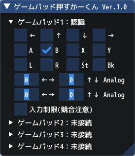

# VRMNXゲームパッド押すかーくん


## 概要
「ゲームパッド押すかーくん」は「[鉄道模型シミュレーターNX](http://www.imagic.co.jp/hobby/products/vrmnx/ "鉄道模型シミュレーターNX")」（VRMNX）でゲームパッドの接続と入力を確認するためのImGuiウィンドウです。  

## ダウンロード
- [gamepadoskar.py](https://raw.githubusercontent.com/CaldiaNX/vrmnx-gamepadoskar/main/gamepadoskar.py)

## 利用方法
レイアウトファイルと同じフォルダ階層に「gamepadoskar.py」ファイルを配置します。  

フォルダ構成：
```
C:\VRMNX（一例）
├ gamepadoskar.py
└ VRMNXレイアウトファイル.vrmnx
```

対象レイアウトのレイアウトスクリプトに以下の★内容を追記します。  

```py
import vrmapi
import gamepadoskar # ★スクリプトインポート

def vrmevent(obj,ev,param):
    gamepadoskar.vrmevent(obj,ev,param) # ★メイン処理
    if ev == 'init':
        dummy = 1
# (省略) #
```

ファイル読み込みに成功するとビュワー起動直後にスクリプトログへ下記メッセージが表示されます。

```
import ゲームパッド押すかーくん Ver.x.x
```

## 操作説明
### ウィンドウの表示/非表示切り替え
「p」キーを押すとウィンドウの表示/非表示を切り替えできます。  
初期表示状態を変える場合は「_drawEnable」のTrue/Falseを変更して下さい。  

### ゲームパッド認識
XInputまたはDirectInput対応のゲームパッド（ゲームコントローラ）を最大4個までのゲームパッドが認識可能です。  
識別は「[IsGamepadConnected](https://vrmcloud.net/nx/script/script/system/IsGamepadConnected.html)」を毎フレーム実行しています。  
※認識にVRMNXの再起動が必要となるコントローラがあります。  

### ゲームパッド入力認識
ゲームパッドが認識されるとボタンの押下やアナログスティックの傾きを検出してチェックボックスとスライドバーが動きます。  
アナログスティックの値範囲はXInputに準じて「-32768～32767」になります。  
※チェックボックスやスライドバーを触ってもボタン操作は代替されません。  

ボタンと識別名は以下の通りです。  
|名称|ゲームパッド|命令|
|----|----|----|
|←|←ボタン|[GetGamepadLEFT](https://vrmcloud.net/nx/script/script/system/GetGamepadLEFT.html)|
|↑|←ボタン|[GetGamepadUP](https://vrmcloud.net/nx/script/script/system/GetGamepadUP.html)|
|↓|↓ボタン|[GetGamepadDOWN](https://vrmcloud.net/nx/script/script/system/GetGamepadDOWN.html)|
|→|→ボタン|[GetGamepadRIGHT](https://vrmcloud.net/nx/script/script/system/GetGamepadRIGHT.html)|
|A |Aボタン |[GetGamepadA](https://vrmcloud.net/nx/script/script/system/GetGamepadA.html)|
|B |Bボタン |[GetGamepadB](https://vrmcloud.net/nx/script/script/system/GetGamepadB.html)|
|X |Xボタン |[GetGamepadX](https://vrmcloud.net/nx/script/script/system/GetGamepadX.html)|
|Y |Yボタン |[GetGamepadY](https://vrmcloud.net/nx/script/script/system/GetGamepadY.html)|
|L |Lボタン |[GetGamepadLEFT](https://vrmcloud.net/nx/script/script/system/GetGamepadLEFT.html)|
|R |Rボタン |[GetGamepadRB](https://vrmcloud.net/nx/script/script/system/GetGamepadRB.html)|
|St|Startボタン|[GetGamepadSTART](https://vrmcloud.net/nx/script/script/system/GetGamepadSTART.html)|
|Bk|Backボタン |[GetGamepadBACK](https://vrmcloud.net/nx/script/script/system/GetGamepadBACK.html)|
|Analog L|アナログスティックL|[GetGamepadAnalogStickLX](https://vrmcloud.net/nx/script/script/system/GetGamepadAnalogStickLX.html)、<br />[GetGamepadAnalogStickLY](https://vrmcloud.net/nx/script/script/system/GetGamepadAnalogStickLY.html)|
|Analog R|アナログスティックR|[GetGamepadAnalogStickRX](https://vrmcloud.net/nx/script/script/system/GetGamepadAnalogStickRX.html)、<br />[GetGamepadAnalogStickRY](https://vrmcloud.net/nx/script/script/system/GetGamepadAnalogStickRY.html)|

### ゲームパッド標準操作制限
「入力制限」にチェックを入れると「[SetGamepadButtonEnable](https://vrmcloud.net/nx/script/script/system/SetGamepadButtonEnable.html)」命令によりVRMNX標準のゲームパッド操作が無効になります。  
チェックを外すと有効化します。  
